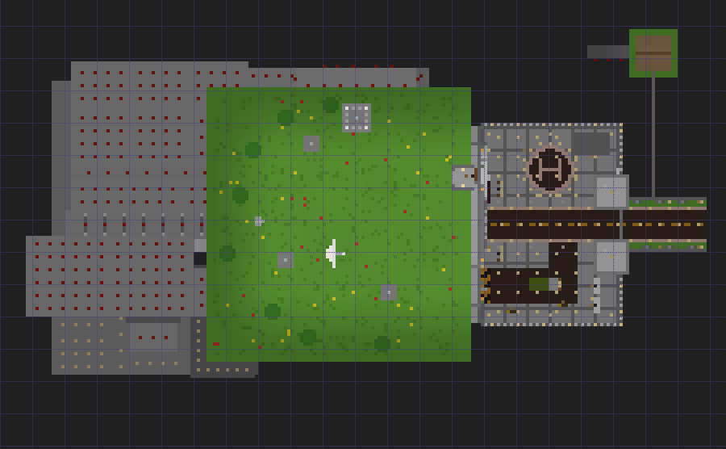
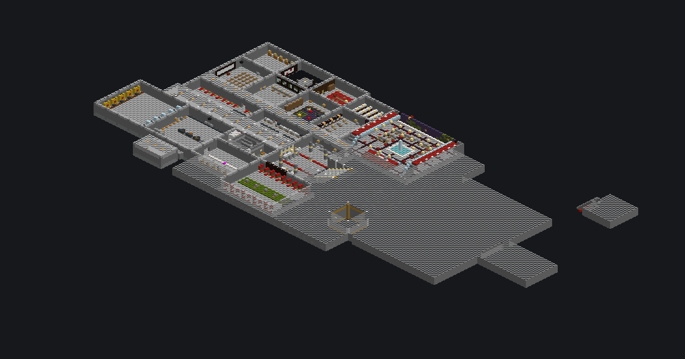
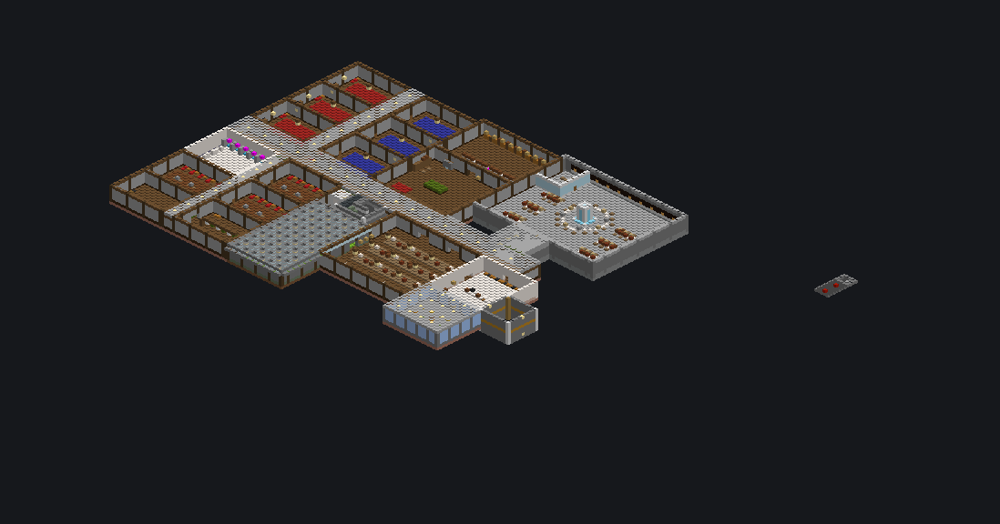
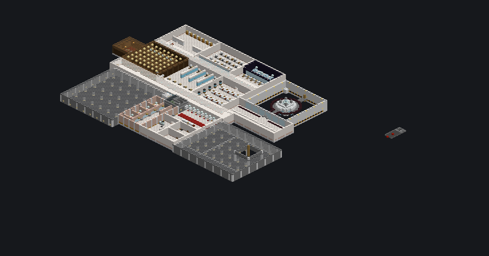
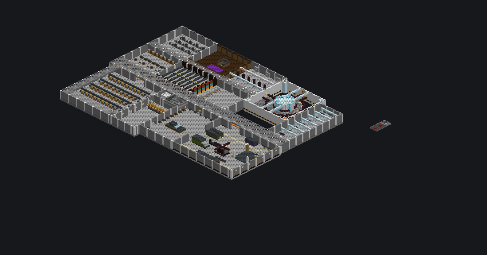
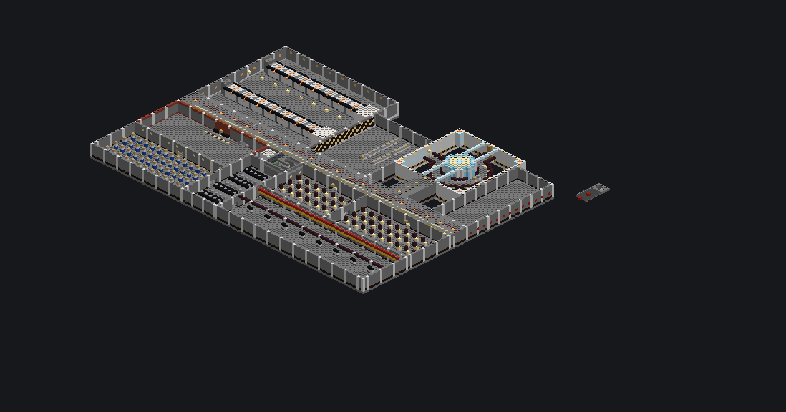
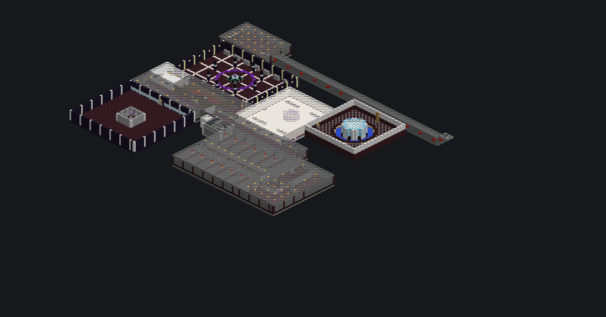

# SITE-7 – Design Document

A decommissioned blacksite dug into an artificial hill: a monumental surface gate, a reactor shaft
through the middle, and six underground levels of 125 rooms and areas. Built entirely from Minecraft
**1.8.8** blocks by the `BlacksiteBunker` plugin.

## 1. Location, orientation, size

| | |
|---|---|
| **Main entrance (anchor)** | **X=-291 Y=68 Z=141**: the threshold of the round "07" vault door in the facade |
| **Facing** | **EAST**. The door faces the courtyard and approach road on the east side. Players arrive from the east and walk **west** into the hill. |
| **Total affected bounds** | **x -436 … -222, y 4 … 127, z 79 … 188** (215 × 124 × 110). Only the 816,763 planned cells are written; everything else in the box is left untouched. |
| **Underground footprint** | about 140 × 110 blocks (x -436 … -297, z 79 … 188) |
| **Surface footprint** | courtyard 43 × 61 (x -291 … -249, z 111 … 171), berm hill over the bunker (x -376 … -295, z 99 … 183), approach road to x -222, pump house at x -242 … -234, z 84 … 92 |
| **Depth / height** | lowest floor at y 4, **64 blocks below the gate**. The tallest rooftop structure reaches y 106. Only the beacon beam's one-block column (x -330, z 108) is kept clear from there up to y 127. |
| **Levels** | surface complex + **6 underground levels**, 10 blocks apart |

**Compass on the maps below:** north is up and east is to the right. The grid lines are 10 blocks apart.

## 2. Getting around

- **Main spine:** every level has an east–west main corridor (z 138 … 144). Rooms open off both sides.
- **Main stairwell** (x -376 … -366, z 145 … 153): a switchback stair that reaches every level. It does not
  need the plugin.
- **Personnel lift** (x -381 … -377, z 145 … 149): right-click **[Lift Up]** / **[Lift Down]** to move one
  level. It needs the plugin.
- **Freight lift:** a **[Lift Up]** sign on the hangar pad (Level 4) goes to Loading Bay B on the surface, and a
  **[Lift Down]** sign there returns. It needs the plugin.
- **Grand Descent Ramp:** a wide 1:2 ramp from Checkpoint Alpha down to Level 1, big enough for a "vehicle".
- **Reactor ladder** on the north wall of the reactor shaft, from the pit to the Level 3 ring.
- **Emergency escape rail** (secret): from Level 6 by minecart to the surface pump house and back. Sit in the cart
  and press the button in front of you. The trip takes about 30 seconds each way.

## 3. Level plan

| Level | Floor block y (you stand 1 higher) | Theme | Headline spaces |
|---|---|---|---|
| Surface | 67 | Gate & approach | Facade with round vault door, courtyard, towers, checkpoint, ramp, loading bay |
| **1** | 55 | Security & Command | **Command Center** (37 × 11 × 31), Armory, Firing Range, Director's Office |
| **2** | 45 | Operations & Living | Central Operations Hall, Mess Hall & Kitchen, **Hydroponics Farm**, dorms, officer suites |
| **3** | 35 | Science & Medical | Labs, Archive, Infirmary & Surgery, Quarantine, Reactor Observation Gallery |
| **4** | 25 | Storage & Engineering | **Hangar** (45 × 15 × 37), **Main Storage Hall** (39 × 15 × 41), **Super Smelter**, Arcane Lab |
| **5** | 15 | Reactor & Power | **Reactor Control**, Turbine Hall, generators, SCRAM room, switchyard |
| **6** | 5 | Containment & Restricted | Cell Block, Interrogation, Containment Chamber Theta, OMEGA Lab, **secrets** |

The **Reactor Chamber** (31 × 39 × 31, x -345 … -315, z 93 … 123) is one open shaft from Level 6 up to Level 3.
It holds a glowing core, catwalk rings on Levels 5, 4 and 3, a coolant pool in the pit and four sealed lava heat
columns. A tier-2 beacon at its bottom (y 7) sends a **light-blue beam straight up** through the core, the Level 2
Operations Hall and the **holo-table in the middle of the Level 1 Command Center**, then out of the exhaust stack
on the hill (y 97). The beam column is locked in the design, so nothing can block it, and the verifier checks it.

## 4. Rooms by level

### Surface complex
Artificial berm (the hill), monumental facade with **"SITE-7"** lettering and the round vault door **"07"**, secure
courtyard with perimeter wall, **north and south gate towers**, approach road, **generator shed**, rooftop
**exhaust stack**, vents, antenna and radar, and the disguised **pump house** (escape exit). Behind the facade:
**Armoured Entry Tube**, **Checkpoint Alpha** (three turnstile lanes of iron doors with pressure plates, two guard
booths, scanner arches, a retracted blast shutter), **Grand Descent Ramp**, **Loading Bay B** (freight lift head,
forklift), **Gate Guard Room**, **Facade Lookout**.

### Level 1 – Security & Command (y 55)
Intake Hall & Checkpoint Bravo · Command Airlock · **Command Center** (tiered consoles, CCTV wall, holo-table with
the beacon beam) · North Wing Corridor · Communications Room · Signals Intelligence · Map & Planning Room ·
Director's Office · *Director's War Room (secret)* · Security Control Room · Briefing Room · Security Storage ·
Equipment Lockers · Guard Quarters · Ready Room · Quartermaster Stores · **Armory** (weapon racks on armor
stands, eight lever-operated lockers, TNT cage) · *Armory Annex (secret)* · Firing Range · Barracks.

### Level 2 – Operations & Living (y 45)
**Central Operations Hall** and Operations Gallery · Mess Hall · Kitchen · Pantry & Cold Room · **Hydroponics
Farm** (wheat, carrots and potatoes on irrigated farmland under glowstone grow lights) · Residential Corridor ·
Crew Dorms A, B, C · Laundry & Maintenance · Showers & Washrooms · General Workshop · Crew Lounge & Rec Room ·
Commissary · Officer Corridor · six named Officer Suites.

### Level 3 – Science & Medical (y 35)
Reactor Observation Gallery · Lab Corridor · Chemistry Lab (brewing stands) · Analysis Lab · Archive & Records ·
*Hidden Records Room (secret)* · Specimen Research & Observation · Clean Room · Sample Storage & Lab Offices ·
Infirmary Ward · Surgery & Treatment · Pharmacy · Medical Supplies · Quarantine & Decontamination · Reactor Top
Ring.

### Level 4 – Storage & Engineering (y 25)
**Hangar & Vehicle Bay** (APC, military truck, helicopter, cargo containers, overhead gantry crane, fuel point,
freight lift pad) · **Main Storage Hall** (four double-sided shelving units of labelled double chests plus a
mezzanine; categories: stone, wood, ores, redstone, mob drops, combat, food, tools, brewing, decoration and
overflow) · Repair Bay · **Super Smelter** (12 furnaces fed in pairs by hoppers from ore and fuel chests, with
all output collected in one chest) · Engineering Corridor & Control · Server Room · Crafting Workshop · Machine
Room & HVAC · **Arcane Lab** (enchanting table ringed by bookshelves, brewing stands) · Redstone Workshop ·
Coolant Pump Station · Reactor Catwalk.

### Level 5 – Reactor & Power (y 15)
**Reactor Control Room** · Turbine Hall · Backup Generators A and B · Power Routing Hall · **Emergency Shutdown
(SCRAM) Room**: the SCRAM lever switches on the alarm lamps · Battery Bank · Transformer Room · Switchyard ·
Reactor Access Corridor · Reactor Catwalk.

### Level 6 – Containment & Restricted (y 5)
Checkpoint Delta · Warden's Office · Project OMEGA Restricted Lab · Cell Block C · Interrogation Room (with a
lamp switch) · Observation Room · Evidence & Confiscation Store · Theta Observation Corridor · **Containment
Chamber Theta** · Reactor pit · *Vault*, *The Blacksite Core* and *Director's Rail Station* (all secret).

Floor plans (top-down) of every level: [L1](docs/images/plan_L1.png) · [L2](docs/images/plan_L2.png) ·
[L3](docs/images/plan_L3.png) · [L4](docs/images/plan_L4.png) · [L5](docs/images/plan_L5.png) ·
[L6](docs/images/plan_L6.png).

## 5. What is inside (counts from the plan)

| | |
|---|---|
| Rooms / areas | 125 (all reachable on foot, checked by the analyzer) |
| Chest blocks | 755 (plus 12 trapped chests). All chests are single or proper double chests, never merged "triple" chests. |
| Furnaces | 106 (12 in the super smelter) |
| Hoppers | 53 |
| Beds | 116 |
| Signs | 320 (room names, directions, storage labels, lore) |
| Iron doors | 83, each with buttons, levers or pressure plates |
| Armor stands, item frames, paintings, minecart | 63 |
| Lift signs | 14 |

Chests hold modest themed supplies (food, basic gear, redstone parts, lore books). Set `furnish-loot: false` for
empty chests with only the lore books.

## 6. Security & redstone features

- **Checkpoint Alpha:** three turnstile lanes of iron doors, each opened by pressure plates on both sides, plus
  guard booths with button-operated doors.
- **Checkpoints Bravo (L1) and Delta (L6)**, the command airlock and cell doors: iron doors with button panels.
- **Armory lockers:** eight lever-operated iron doors. One of them is not a locker (see secrets).
- **Piston bookcase door** in the Archive: sticky pistons, lever hidden under a bookcase.
- **Light switches:** security alarm lamps (L1) and the interrogation lamp (L6).
- **Reactor SCRAM** (L5): throwing the SCRAM lever lights the alarm lamps.
- **Super smelter:** a working hopper line in 1.8.
- **Escape rail:** each end has a brake rail against a bumper, and a launch button right above it.
- Lamps are powered by hidden redstone blocks, so no loose redstone dust is exposed. The TNT cage has no power
  source near it.

`bunker selftest` operates every moving part on a live server: every door, the lockers, the piston door, the light
switches, the SCRAM, the smelter and a full round trip on the escape rail.

## 7. Secrets

There are six secret areas. Each has a lore book or sign that hints at it. Spoilers below.

Show the secrets

1. **Director's War Room (L1).** The west wall of the Director's Office has a painting of *The Wanderer*.
   It is a walk-through passage: step into the painting. The hint sign reads "Keep the Wanderer on the wall."
2. **Armory Annex (L1), the hardest to notice.** The Armory has eight lever lockers. **Locker 5** has no back
   wall: it opens onto a one-block passage to the annex (Director's Sabre, the Longshot bow, special gear).
3. **Hidden Records Room (L3).** In Archive & Records, one bookcase sticks out from the west wall. The lever is
   underneath it. Flip it and a sticky-piston bookshelf door opens. There is a lever inside to close it again.
4. **Vault (L6).** In the Warden's Office, a button is hidden behind the bust. It opens the vault's iron door
   (gold, diamonds, the vault ledger).
5. **The Blacksite Core (L6).** The Warden's north bookcase has one column that is "one shelf too short". The
   *Graham* painting there is a walk-through passage into the Core: obsidian pillars, purple light, the
   artefact and the final lore entry.
6. **Director's Rail Station (L6).** An iron door on the north side of the Core leads to the private station.
   Sit in the minecart and press the button on the bumper in front of you. The cart runs east along the tunnel
   at y 6, climbs a powered-rail incline and stops inside the **pump house on the surface** (-236 68 88). There,
   the button above the rail sends you back down, and a chest holds a spare minecart. The route works in both
   directions, so the pump house is also a back door into the Core.

## 8. Lighting, mobs and safety

- Every floor block that a mob could spawn on (y ≥ 40) is lit to **light level 8 or more**. The verifier
  measured 0 dark spots in the live world.
- Below y 40, slimes can spawn in slime chunks at any light level. Every floor down there is slabs or carpet, so
  nothing spawns on it. The only exception is the **secret escape rail track**: 139 rail blocks, which cannot be
  carpeted. The verifier reports these separately.
- **No fire hazards:** no fire, no netherrack, no flammable blocks next to heat. The 5 lava features (a fireplace
  and 4 reactor heat columns) are fully sealed.
- The builder seals the facility's outer shell with stone, so caves, water, lava and gravel cannot leak in.
- Natural mob spawners that end up inside the area are removed. Dropped items and stray mobs are cleaned up
  after building.
- Every attachable block has valid support under 1.8 block physics. Ladders, signs, buttons, levers, trapdoors,
  rails and pots will not pop off when players build nearby.

## 9. 1.8.8 compatibility notes

- Only block IDs from 1.8.8 are used.
- **Sea lanterns and prismarine are 1.8 blocks.** They were added in 1.8 and work on 1.8.8 servers and in
  Eaglercraft 1.8.8, so the bunker uses them as light panels.
- 1.8 behaviour the design accounts for:
  - Redstone lamps need power when placed.
  - Lit furnaces go out without fuel.
  - A hopper under another hopper pulls items out of it.
  - Wall signs and paintings need a solid block behind them.
  - Touching chests merge.
  - Slimes ignore light.
