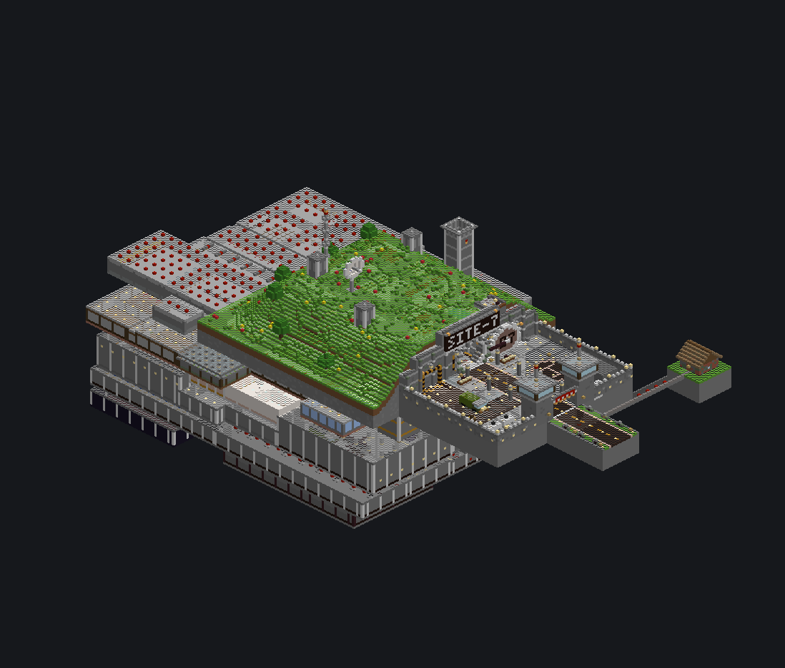

# SITE-7 Blacksite Bunker (Minecraft 1.8.8 plugin)

A Bukkit/Spigot/Paper **1.8.8** plugin that builds **SITE-7**, a huge underground blacksite, into your world
in safe tick-budgeted batches. You only type short commands, so it suits hosts whose web console cuts off
long commands, such as EaglerHost.



| | |
|---|---|
| **Plugin JAR** | [`dist/BlacksiteBunker-1.0.0.jar`](dist/BlacksiteBunker-1.0.0.jar) |
| **Install guide** | [`PLUGIN_INSTALL.md`](PLUGIN_INSTALL.md) |
| **Design document** | [`BUNKER_DESIGN.md`](BUNKER_DESIGN.md): levels, rooms, secrets, maps |
| **Test report** | [`TEST_REPORT.md`](TEST_REPORT.md): what was tested on a real 1.8.8 server |
| **Main entrance** | **X=-291 Y=68 Z=141**, blast door facing **EAST** |
| **Bounds** | x -436 … -222, y 4 … 127, z 79 … 188 |
| **Size** | surface complex + 6 underground levels, 125 rooms/areas, 64 blocks deep |

## Quick start

1. Upload `dist/BlacksiteBunker-1.0.0.jar` to the server's `plugins/` folder and restart.
2. In the console, type `bunker build`. Read the warning, then type `bunker confirm` within 60 seconds.
3. Watch `bunker status`. When it says `RESULT: PASS`, use `/bunker tp entrance` in game.

Details, recovery after crashes, settings and troubleshooting are in [PLUGIN_INSTALL.md](PLUGIN_INSTALL.md).

## Building from source

```
mvn -B package      # JDK 8+ and Maven; output target/BlacksiteBunker-1.0.0.jar
```

- `src/main/java/com/blacksite/bunker/design`: the bunker as code. It is a deterministic voxel plan with one
  class per level, plus the surface, entrance, vertical cores, reactor and beacon conduit. `Finisher` seals,
  lights and spawn-proofs the plan, and `Analyzer` checks it offline.
- `src/main/java/com/blacksite/bunker/build`: the staged builder (`BuildJob`), the world verifier
  (`VerifyJob`), the in-world mechanism test (`SelfTest`) and low-level placement (`Placer`).
- `src/main/java/com/blacksite/bunker/plugin`: commands, sign lifts, state and chunk handling.
- `src/test/java/com/blacksite/bunker/tools`: offline tools. They include an isometric/plan renderer, the
  analyzer runner and a block probe.
